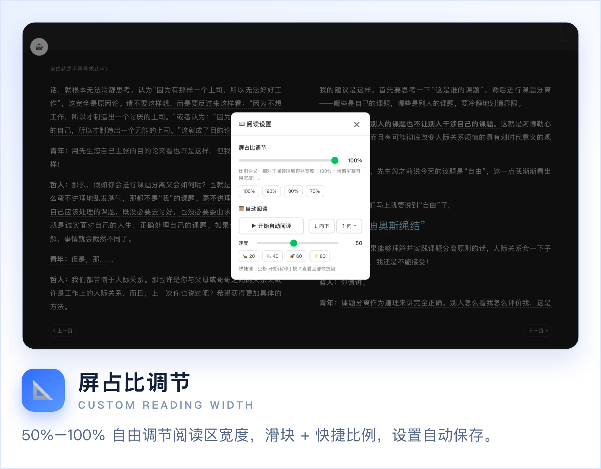
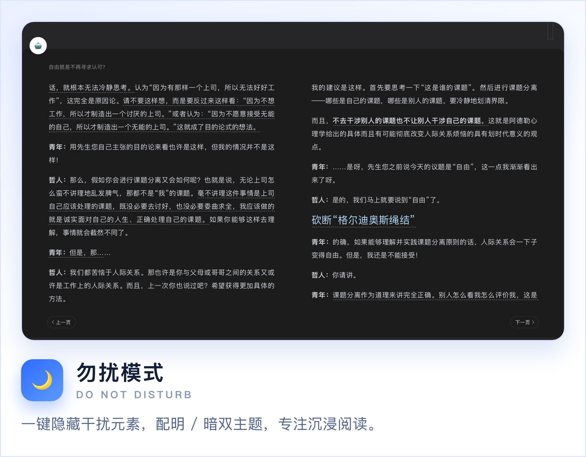
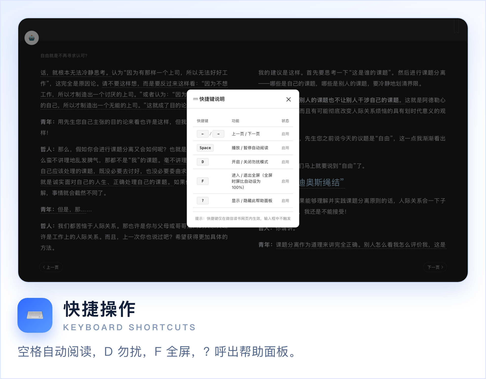
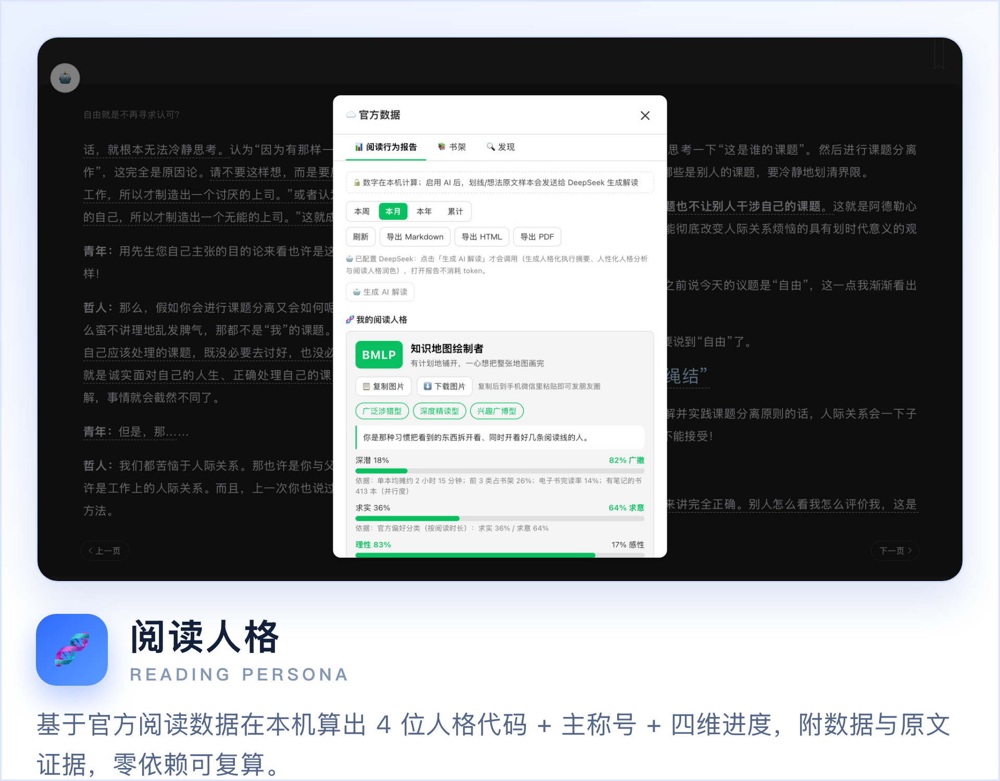
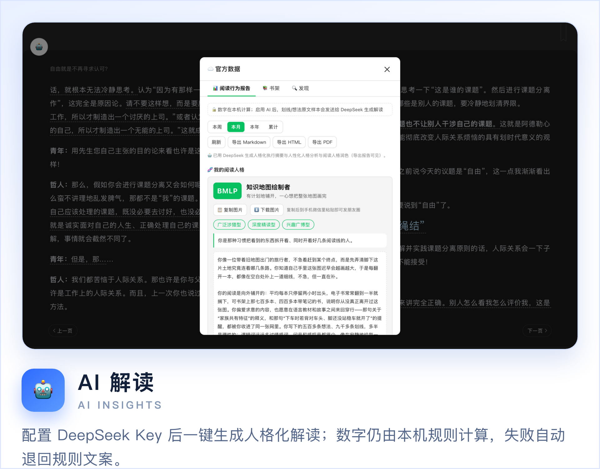
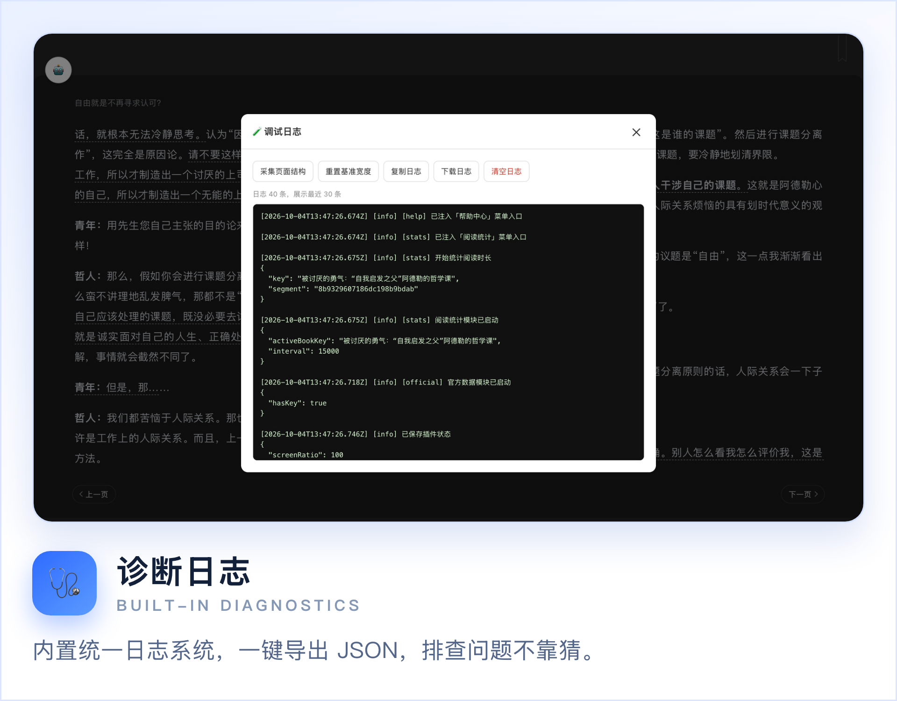

# 微信悦读 - 浏览器插件

专为微信读书网页版（weread.qq.com）打造的阅读增强浏览器扩展。

<p>
  <a href="https://microsoftedge.microsoft.com/addons/detail/%E5%BE%AE%E4%BF%A1%E6%82%A6%E8%AF%BB/nkcckbonpafeclefhlhbencibkaabmgb"></a>
  
  
</p>

## 界面预览

<p align="center"></p>
<p align="center"></p>
<p align="center"></p>
<p align="center"></p>
<p align="center"></p>
<p align="center"></p>
<p align="center"></p>
<p align="center"></p>

> 以上均为插件真实界面；商店上架用的宣传磁贴与截图见 [screenshots/store](screenshots/store)。全部展示素材的分类与「功能→图片」对照见 [screenshots/素材清单.md](screenshots/素材清单.md)。

## 已实现功能

- **自定义屏占比**：50%-100% 自由调节阅读区域宽度，滑块 + 快捷比例按钮，设置自动保存
- **工具栏浮动悬停**：屏占比 ≥90% 时自动隐藏原生工具栏，鼠标移到顶部/右侧感应区淡入显示，点击正常（翻页 / 滚动模式均适配）
- **滚动模式增强**：正文屏占比自适应居中不溢出、工具栏浮动、自绘悬浮滚动条（鼠标靠右淡入、可拖动跳转），刷新后记忆
- **自动阅读**：速度滑块 + 方向切换 + 开始/暂停，空格键快捷控制
- **快捷键操作**：空格（自动阅读）、D（勿扰）、F（全屏）、?（帮助/调试面板）
- **勿扰模式**：隐藏干扰元素，专注沉浸阅读
- **全屏模式**：F 键切换，保留屏占比/勿扰状态，退出自动恢复
- **新手引导**：首次安装或版本更新时弹出欢迎面板
- **刷新记忆**：刷新页面后自动恢复上次的全部设置
- **阅读统计与数据导出**：统计前台阅读时长（今日 / 本周 / 本月 / 本书），显示当前书籍进度与最近 10 本书（可点击跳转），一键导出 HTML 报表 / PDF / Markdown / CSV / JSON
- **笔记增强**：菜单「📝 笔记」一键聚合本书全部划线与想法/批注（按章节分组，内置搜索框按关键词实时定位某条笔记），支持一键复制笔记（富文本 + 干净纯文本，无 Markdown 符号，可直接粘到记事本/微信）与 Markdown / 纯文本 / HTML / PDF 导出；选中正文文字即弹出「复制」浮标，自动清洗官方水印后再复制。**读取笔记需先配置官方 API Key**：未配置或已失效时面板会拦截并引导一键跳转到「🔑 API Key」
- **官方数据（阅读行为报告）**：在主菜单「🔑 API Key」粘贴自己的微信读书 `wrk-` API Key（与 DeepSeek Key 集中在这一个入口）后，打开菜单「☁️ 官方数据」拉取官方口径阅读数据（`/readdata/detail` + `/shelf/sync` 书架 + `/user/notebooks` 笔记概览），生成本机「阅读行为报告」——按深度画像式章节组织：元信息 → 执行摘要 → 数据全景（核心指标 / 书架结构 / 官方概要 / 偏好分类）→ 阅读轨迹与时间线 → 阅读时段分布 → 偏好画像（作者 / 出版社 / 版权方）→ 读得最多 → 书的印象 → 成就勋章 → 知识脉络 → 笔记行为 → 完读率 → 已读完书目 → 阅读人格画像（客观规则化类型归类：完读倾向 / 笔记投入 / 主题聚焦 / 内容形态 / 阅读时段）→ 附录数据说明；**首屏另有「🧬 我的阅读人格」**：基于你自己的官方数据在本机算出 4 位「读书人版」人格代码（深潜/广撒 · 求实/求意 · 理性/感性 · 计划/随兴 四维，各维给判定值与数据依据）+ 主称号 + 三个特质绰号 + 一句定调 + 数据/原文证据 + 词语分析（高频词 TOP10 / 情绪比例 / 你的口头禅 / 主题词 / 纯 CSS 词云）——**零外部依赖、纯本机计算、可复算、不配 AI 也完整可用**；数据不足时走降级引导、绝不硬出结论（页面固定声明「趣味参考、非心理测评」，不使用 MBTI® 商标名）；支持本周 / 本月 / 本年 / 累计四种周期切换，一键导出 Markdown / HTML / PDF（Markdown 与 HTML 共用同一份报告模型，避免两套渲染漂移）。书架/笔记章节独立缓存 30 分钟；某一路接口失败只降级对应章节并给出提示，不影响报告主体。**可选接入 DeepSeek**：在同一个「🔑 API Key」入口粘贴自己的 DeepSeek Key（`sk-` 开头）后，「一、执行摘要」由规则化摘要升级为 AI 生成的人格化解读——数字仍在本机算准，人格化文字交给 DeepSeek 生成；未配置或生成失败自动退回规则化摘要。面板顶部另有「📚 书架」与「🔍 发现」两个页签：书架页汇总电子书 / 专辑 / 公众号数量并分区展示（封面 / 作者 / 进度 / 来源，支持「显示更多」）；发现页可搜书（9 种范围、翻页）、看推荐、看公开书评（5 种类型、星级、翻页）、找相似书，并可查看书籍详情与目录；所有条目的跳转统一换成电脑可打开的**网页版书籍详情页**（官方回包多为 App 专用地址，插件按书名到同源搜索接口解析出网页版链接后再打开），不自行拼接链接
- **诊断日志**：内置调试日志系统，可导出为 JSON 文件辅助排查问题
- **帮助中心**：主菜单「📖 帮助中心」一键跳转配套网站首页；启动时静默检查网站 `/api/latest.json`，发现新版本在入口旁显示红点（失败静默）

## 安装方式

### 开发模式（加载已解压的扩展）

1. 打开 Edge 浏览器，地址栏输入 `edge://extensions/`
2. 开启左侧的「开发人员模式」
3. 点击「加载解压缩的扩展」
4. 选择本项目的根目录（包含 `manifest.json` 的文件夹）
5. 打开 https://weread.qq.com 即可看到效果

### 从 Edge 商店安装

插件已上架 Microsoft Edge 加载项商店，[点此一键安装](https://microsoftedge.microsoft.com/addons/detail/%E5%BE%AE%E4%BF%A1%E6%82%A6%E8%AF%BB/nkcckbonpafeclefhlhbencibkaabmgb)。

## 项目结构

```
微信读书插件/
│
├── manifest.json          # 🔧 扩展入口（不动）
├── content.js             # 🔧 核心逻辑（不动）
├── content.css            # 🔧 样式（不动）
├── background.js          # ☁️ Service Worker：官方网关转发 + API Key 管理 + 可选 DeepSeek 转发
├── modules/               # 🆕 新功能模块（旧代码不动）
│   ├── stats.js           # 📊 阅读统计与导出
│   ├── stats.css          # 📊 统计面板样式
│   ├── notes.js           # 📝 笔记增强（划线/想法聚合 + 导出 + 选中复制）
│   ├── notes.css          # 📝 笔记面板样式
│   ├── official.js        # ☁️ 官方数据：阅读行为报告 + 书架概览 + 发现（搜书/书评/推荐）+ 可选 DeepSeek AI 执行摘要；🔑 API Key 集中入口
│   ├── official.css       # ☁️ 官方数据面板样式
│   ├── support-center.js  # 💗 支持与反馈中心（打赏 / 反馈 / 公众号 三页签）
│   ├── support-center.css # 💗 支持与反馈中心样式
│   ├── help.js            # 📖 帮助中心：跳转配套网站 + 新版本红点提示
│   └── help.css           # 📖 帮助中心样式
├── icons/                 # 🔧 插件图标（不动）
│   ├── icon-16.png
│   ├── icon-48.png
│   └── icon-128.png
│
├── README.md              # 📖 项目首页
├── .gitignore
│
├── web/                   # 🌐 配套网站（文档站，见下方「配套网站」）
│   ├── content/           #    文章源（Obsidian vault，唯一事实源）
│   ├── assets/            #    站点 CSS / JS / 图片
│   ├── templates/         #    页面骨架
│   ├── site.config.json   #    站点名 / 导航 / 栏目 / 商店链接
│   ├── build.py           #    一键构建：content/*.md → dist/ + dist/api/latest.json
│   ├── serve.py           #    本地预览（零依赖）
│   ├── vercel.json        #    Vercel 海外镜像配置（可选，主站已迁帽子云）
│   └── dist/              #    构建产物（不入库）
│
├── plan/                  # 📋 规划
│   ├── RPD_需求文档.md
│   ├── plan_edge_store.md
│   └── plan_github_versioning.md
│
├── dev/                   # 🔧 开发
│   ├── session_log.md
│   └── project-rules-v1.0.md
│
├── test/                  # 🧪 测试验收清单
│   ├── 快捷键测试清单.md
│   ├── 新手引导测试清单.md
│   ├── 自动阅读测试清单.md
│   ├── 笔记增强测试清单.md
│   └── 官方数据测试清单.md
│
├── release/               # 🚀 上线
│   ├── privacy.md
│   ├── 360-素材/           #    360 商店上传素材（560×350 效果图 / 图标 / 功能说明）
│   └── weread-enhancer-v0.15.0.zip
│
├── screenshots/           # 📸 截图与展示素材
│   ├── 素材清单.md         #    总纲：分类 + 功能→图片对照 + 缺口（先看这份）
│   ├── promo/             #    GitHub 展示图：Banner + 功能亮点卡片（promo.py 生成）
│   ├── store/             #    商店素材：440×280 / 1400×560 宣传图 + 带标题栏的 1280×800 截图
│   └── auto/              #    自动抓图母版（不入库，由 tools/autoshot.py 生成）
│
├── promo.py               # 🎨 一键生成上述展示素材（HTML → Chrome 无头截图 → PNG）
├── pack.py                # 📦 一键打包上架 zip
│
├── usage/                 # 📖 使用指南
│   ├── Running.md
│   └── GitHub操作手册.md
│
└── inbox/                 # 📥 待归类
```

## 配套网站（文档站）

插件配套一个对外网站（教程 / 技巧 / 阅读方法论 / FAQ / 更新日志），源码在 `web/`。

- 文章源在 `web/content/`，可直接用 Obsidian 打开为 vault 编辑（front-matter 即 Obsidian 属性，支持 `[[双链]]`、`![[图片]]`、callout）
- 构建与预览（零第三方依赖，本机 Python 3.9 即可）：

```bash
python3 web/build.py    # 构建：生成 web/dist/ 与 web/dist/api/latest.json
python3 web/serve.py    # 本地预览：http://localhost:5173
```

- `web/dist/api/latest.json` 的版本号在构建时自动读仓库根 `manifest.json`，是插件「版本提示」的单一事实源
- 线上地址：https://wereadapp-32km31c.maozi.io（帽子云静态托管，国内可直连）；部署方式见 `plan/session_handoff_网站帽子云部署.md`

## 隐私声明

本插件**不收集、不上传任何用户数据**。所有设置保存在浏览器本地存储中。详见 [privacy.md](release/privacy.md)。

## 开源许可

MIT License
